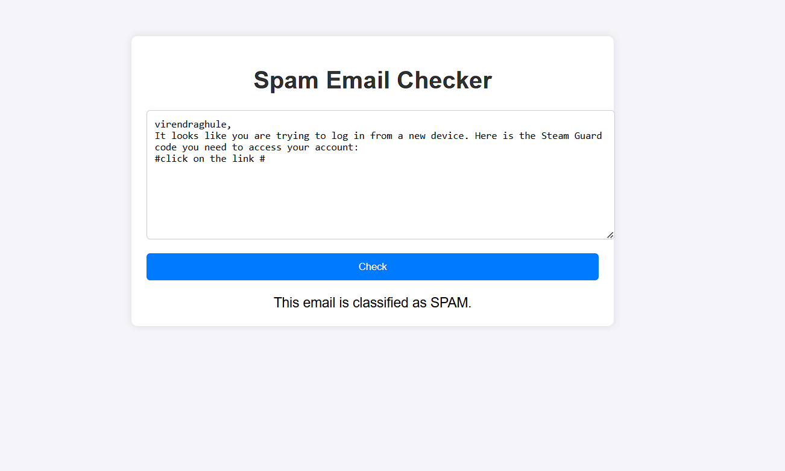

# Spam Email Checker

This is a machine learning-based web application that classifies emails as **SPAM** or **NOT SPAM** using natural language processing (NLP). The application is built with Flask and includes a simple web interface for users to input email text and receive predictions.

---

## **File Structure**

```
project-folder/
├── app.py                # Main Flask application
├── dataset/              # Folder containing the dataset
│   └── email.csv         # Dataset file (spam email data)
├── spam_model.pkl        # Trained ML model
├── tfidf_vectorizer.pkl  # Trained TF-IDF vectorizer
├── templates/            # Folder containing HTML templates
│   └── index.html        # Web interface template
└── README.md             # Project documentation
```

---

## **Getting Started**

### **Prerequisites**

- Python 3.7+
- Required Python packages:
  - Flask
  - scikit-learn
  - pandas
  - joblib

Install the required packages:

```bash
pip install flask scikit-learn pandas joblib
```

---

### **Setup Instructions**

1. Clone the repository or download the project files.

   ```bash
   git clone https://github.com/yourusername/spam-email-checker.git
   cd spam-email-checker
   ```

2. Place your dataset (`email.csv`) in the `dataset/` folder.

3. Train the model (if not already trained):

   - Open a Python script or notebook.
   - Load `email.csv` for training.
   - Save the trained model as `spam_model.pkl` and the TF-IDF vectorizer as `tfidf_vectorizer.pkl` in the project root directory.

   If you already have these files (`spam_model.pkl` and `tfidf_vectorizer.pkl`), skip this step.

4. Run the Flask application:

   ```bash
   python app.py
   ```

5. Open your web browser and navigate to `http://127.0.0.1:5000`.

---

## **Using the Application**

## **Webpage Screenshot**

Below is a screenshot of the web interface:



1. Enter email text in the input field on the web interface.
2. Click the **Check** button.
3. View the result: The app will display whether the email is classified as **SPAM** or **NOT SPAM**.

---

## **Dataset**

The dataset (`email.csv`) should contain email text and labels (e.g., `0` for NOT SPAM and `1` for SPAM). If you're using your own dataset, ensure it is preprocessed appropriately.

---

## **Model Training**

The model is trained using:

- **TF-IDF Vectorizer**: Converts email text into numerical features.
- **Logistic Regression**: Used for binary classification.

### Training Steps:

1. Preprocess the text by removing special characters, converting to lowercase, and tokenizing.
2. Vectorize the text using TF-IDF.
3. Train the Logistic Regression model.
4. Save the model and vectorizer using `joblib`.

---

## **Technologies Used**

- **Python**
- **Flask**: For building the web application.
- **scikit-learn**: For machine learning and text processing.
- **HTML/CSS**: For the front-end web interface.

---

## **Future Enhancements**

- Improve model accuracy by exploring advanced NLP techniques (e.g., word embeddings or deep learning).
- Add more user-friendly features to the web interface.
- Deploy the application to a cloud platform (e.g., Heroku, AWS, or Google Cloud).

---

## **License**

This project is open-source and available under the [MIT License](LICENSE).

---

## **Author**

[Virendra Ghule](https://github.com/Virendra108)


